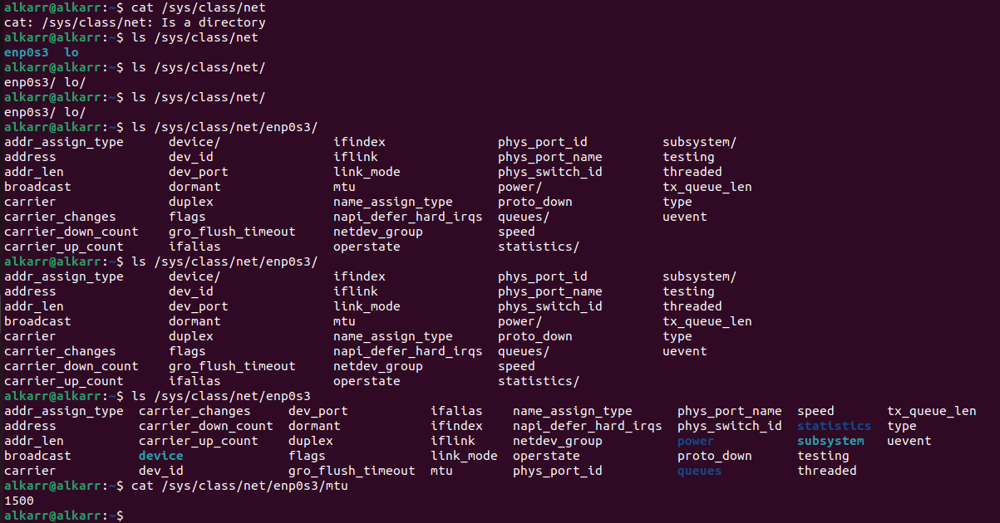

## LAB2 - Linux

### Задание 1. Kernel and Module Inspection 

- Продемонстрировать версию ядра вашей ОС:


- Показать все загруженные модули ядра.


- Отключить автозагрузку модуля cdrom.

Для этого в файл `/etc/modprobe.d/blacklist.conf` был добавлен cdrom в blacklist


Можно так же командой: 
```bash 
echo "blacklist cdrom" >> sudo tee -a /etc/modprobe.d/blacklist.conf
```

- Найти и описать конфигурацию ядра (файл конфигурации, параметр CONFIG_XFS_FS).

Необходимый файл находится по пути `/boot/config-$(uname -r)`, через `grep` находим нужный параметр


Параметр со значением `m` означает, что поддержка файловой системы (FS) XFS включена и работает как загружаемый модуль  

### Задание 2. Наблюдение за VFS

- Используйте strace для анализа команды cat  /etc/os-release > /dev/null.

Вызов команды `strace -e trace=openat,read,write,close cat/etc/os-release > /dev/null`


- Описать открываемый и читаемый файл, объяснить отсутствие записывающих вызовов в выводе.

Сам по себе файл содержит информацию о дистрибутиве:


`> /dev/null` — перенаправление вывода команды cat в "пустоту", то есть в устройство `/dev/null`, где все данные, направляемые в него, просто игнорируются 

`openat` - системный вызов открытия файла на чтение, получая файловый дескриптор 3

`close` - системный вызов закрытия файлового дескриптора

`read` - системный вызов чтения данных по файловому дескриптору

1. По началу до вызова `openat` самого файла идут различные чтения данных в виде кэша, библиотеки
2. Чтение данных из файла по fd = 3
3. Дальше идет вызов `write` - запись считанных данных из fd = 3, в fd = 1 (файловый дескриптор stdout стандартного потока вывода).
4. Потом доп. вызов `read` - но тут достигнут конец файла
5. Тк чтение и запись закончились - идет вызов `close` fd = 3
6. И закрытие fd = 1, fd = 2 (stderr - стандартный поток ошибок)

Тк идет отправка перенаправление стандартного потока вывода в /dev/null - вывода в самом в терминале нет 

### Задание 3. LVM Management

- Добавить к своей виртуальной машине диск /dev/sdb размером 2GB.

Добавление нового диска размером 2GB:


Проверяем, что он появился:


- Создать раздел на /dev/sdb, используя fdisk или parted.

Создаем новый раздел командой `sudo fdisk /dev/sdb`


- Создать Physical Volume (PV) на этом разделе.


Проверяем создание:


- Создать Volume Group (VG) с именем vg_highload.

Создаем и проверяем создание:


- Создать два Logical Volume (LV): data_lv (1200 MiB) и logs_lv (оставшееся место).

Создаем два LV и проверяем создание:
        


- Отформатировать data_lv как ext4 и примонтировать в /mnt/app_data.


            
- Отформатировать logs_lv как xfs и примонтировать в /mnt/app_logs.

Для xfs пришлось ставить модуль xfsprogs, тк изначально не было возможности отформатировать в xfs:


Форматируем, монитруем и проверяем тип:


### Задание 4. Использование pseudo filesystem
        
- Извлечь из /proc модель CPU и объём памяти (KiB).

Просмотрев, что есть в /proc - `ls -la /proc`, я заметил `cpuinfo`


Вызвал `cat /proc/cpuinfo` - нужное поле `model name`


По аналогии с памятью - файл meminfo - нужное поле `MemTotal` (1 строчка в файле)


И что было выделено


- Используя /proc/$$/status, найдите Parent Process ID (PPid) вашего текущего shell. что означает $$?

$$ - означает PID (process ID) оболочки - в данном случае bash, вызов `cat /proc/$$/status` позволяет узнать PPid - выделенная строчка 


- Определить настройки I/O scheduler для основного диска /dev/sda.


`none [mq-deadline]` - возможны 2 настройки, но включенные в данный момент `[mq-deadline]`, тк выделено в `[]`

- Определить размер MTU для основного сетевого интерфейса (например, eth0 или ens33).

Посмотрим, какие есть подключенные интерфейсы:




Размер `mtu` = 1500