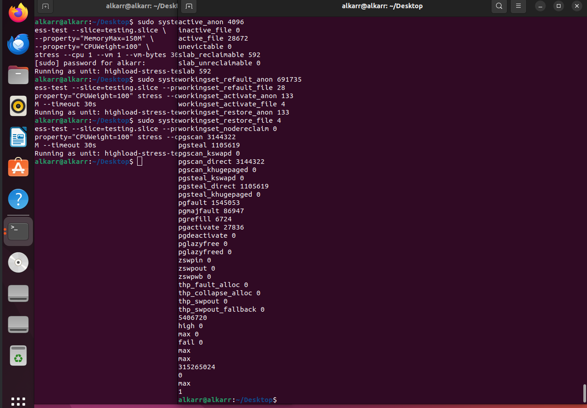
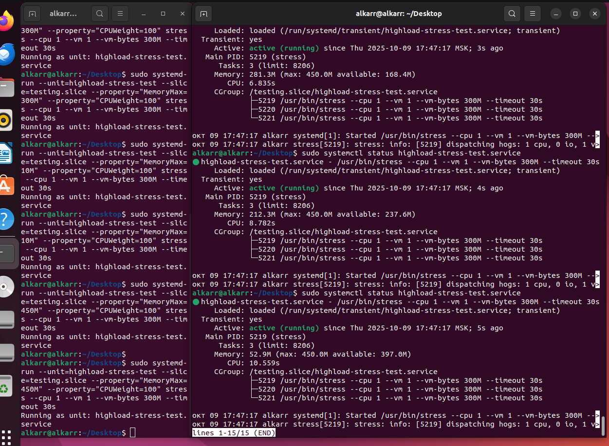

## LAB3 - Linux memory

### Задание 1. Systemd

- Создайте bash-скрипт /usr/local/bin/homework_service.sh

Так же дам сразу же права на запуск (`chmod`)


- Создайте systemd unit файл для скрипта, который бы переживал любые обновления системы. Убедитесь, что сервис сам перезапускается в случае падения через 15 секунд.


- Запустите сервис и убедитесь, что он работает.


Проверяем, что есть heartbeats


- Используя systemd-analyze, покажите топ-5 systemd unit`ов стартующих дольше всего.


### Задание 2. Межпроцессное взаимодействие (IPC) с разделяемой памятью

Создайте шареную память:


Скомпилируйте и запустите


Пока программа запущена (60 секунд), проанализируйте вывод:
в соседнем терминале запустите ipcs -m. Обратите внимание на  nattch (number of attached processes) проанализируйте вывод


У меня `nattch = 0` - значит, что ни один процесс не использует шареную память, тк в главной программе она просто создается, но никак не изменятся. 
То есть она просто существует без изменений. Так же можно увидеть ключ (место в памяти) и Id памяти, по которому можно обратиться другим процессом для взаимодействия.
Владельца (owner) - то бишь я , доступы - 666 (110 - чтение + запись), и размер = 1024 bytes.

### Задание 3. Анализ памяти процессов (VSZ vs RSS)

- Откройте 1 окно терминала и запустите питон скрипт, который запрашивает 250 MiB памяти и держит ее 2 минуты
- Пока скрипт запущен, откройте вторую вкладку, найдите там PID запущенного скрипта и проанализируйте использование RSS и VSZ:


* PID - номер процесса
* USER - в данном случае я, тот, кто запустил прилу
* %MEM - процент занятой памяти от общей (250 mB / 709200 kB (MemTotal из прошлой лабы) * 100 % ~ 3.7%)
* COMMAND - python3 (запущенный скрипт)
* RSS - Resident Set Size - объем физической памяти, реально занимаемый процессом в RAM. 
250 mB * 1024 = 256 000 kB + загруженные дополнительны модули и библы (различные процессы) / сам интерпретатор
* VSZ - Virtual Set Size - общий объем виртуальной памяти процесса. 
В данном случае больше, тк могут быть подгружены дополнительные страницы для памяти, но по факту неиспользуемые. 
То есть показывается та память, которая гипотетически может быть использована процессом, а RSS - реально использованную.
Так же могут быть использованы различные расшаренные сегменты памяти, которые используются другими процессами. Так же в учет идет выгруженные данные (тот же файл подкачки).

### Задание 4. NUMA и cgroups 

- Продемонстрируйте количество NUMA нод на вашем сервере и количество памяти для каждой NUMA ноды


Всего 1 нода, размер - 6925 MB, сводно - 3904 MB

- Убедитесь что вы можете ограничивать работу процессов при помощи systemd.
- Запустите

```bash
sudo systemd-run --unit=highload-stress-test --slice=testing.slice \
--property="MemoryMax=150M" \
--property="CPUWeight=100" \
stress --cpu 1 --vm 1 --vm-bytes 300M --timeout 30s
```

Запускаем скрипт:


Через командочку `systemd-cgtop` смотрим за процессом


И так вызов: `systemd-cgls`


Вызов `sudo systemctl status testing.slice`


И вызов `sudo systemctl status highload-stress-test`


Вызов `sudo cat /sys/fs/cgroup/testing.slice/memory.*`




Количество OOM (out of memory) - 0

- Будет ли работать тест если мы запрашиваем 300М оперативной памяти, а ограничиваем 150М?

Как видно из результатов - тест прошел успешно, ограничение по памяти было 150 MB

- В соседней вкладке проследите за testing.slice при помощи systemd-cgls. Превысило ли использование памяти 150М ? Что происходит с процессом при превышении? Попробуйте использовать разные значения 

Запущу теперь со значением MemoryMax = 300 MB:


Теперь используемая память варьируется от ~50МБ до 300МБ


OOM - не было

Запущу теперь со значением MemoryMax = 10 MB:


Проработало без проблем, максимум 14.7 - 4.7 (процесс в простое жрет 4.8 МБ)


И для 450 MB:





Значения скакали от 0 до 300, не превышая лимит в 300МБ 

Поменяю теперь значение CPUWeight=50, MemoryMax=450


Как видно, загрузка %CPU не стала 50, либо 100, а держится на уровне 200, как и было для MemoryMax = 450MB.

- Опишите что делает и для чего можно использовать MemoryMax and CPUWeight.

**MemoryMax** устанавливает жесткий лимит на использование оперативной памяти для всех процессов, работающих в данном юните.

Можно использовать, что бы гарантировать, что определенный сервис не будет превышать лимит по выделенной памяти (защита)
Так же можно попробовать протестировать приложение в рамках ограниченных ресурсов.

**CPUWeight** - это относительный приоритет при распределении процессорного времени между процессами. Например, для 2ух процессов установили лимиты в 100 и 200 соответственно,
то 2ой процесс получит в 2 раза больше процессорного времени. 

Можно использовать, что бы повысить приоритет какого-то важного сервиса, так и наоборот, понизить для это время для прожорливого.
