## LAB4 - Network Stack

### Задание 1. Анализ состояний TCP-соединений (25 баллов)
- Запустите Python HTTP сервер на порту 8080:
```bash
python3 -m http.server 8080
```

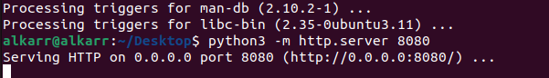

- Проверяйте слушающие TCP-сокеты с помощью утилиты ss. найдите сокет с вашим http сервером.

Вызов `ss -tlnp | grep 8080`

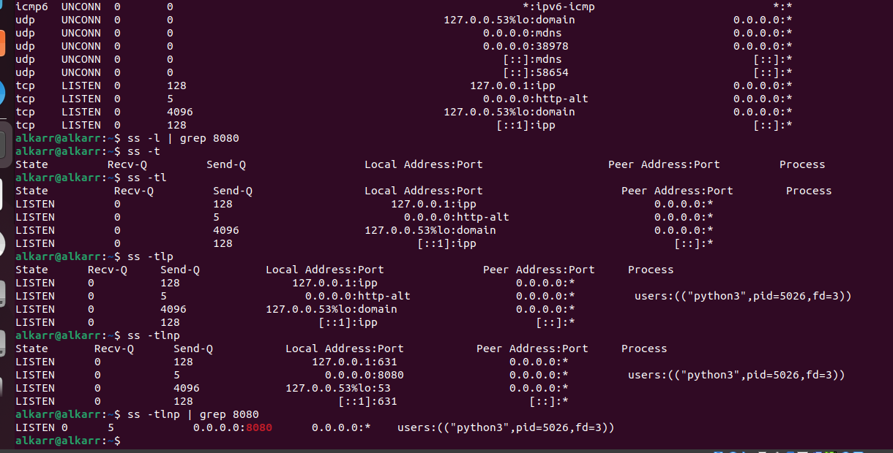

- Подключитесь к серверу через curl.
- Проанализируйте состояние TCP-сокетов для порта 8080, объясните, почему есть сокет в состоянии TIME-WAIT, его роль и почему его нельзя удалить.

Полученный результат:

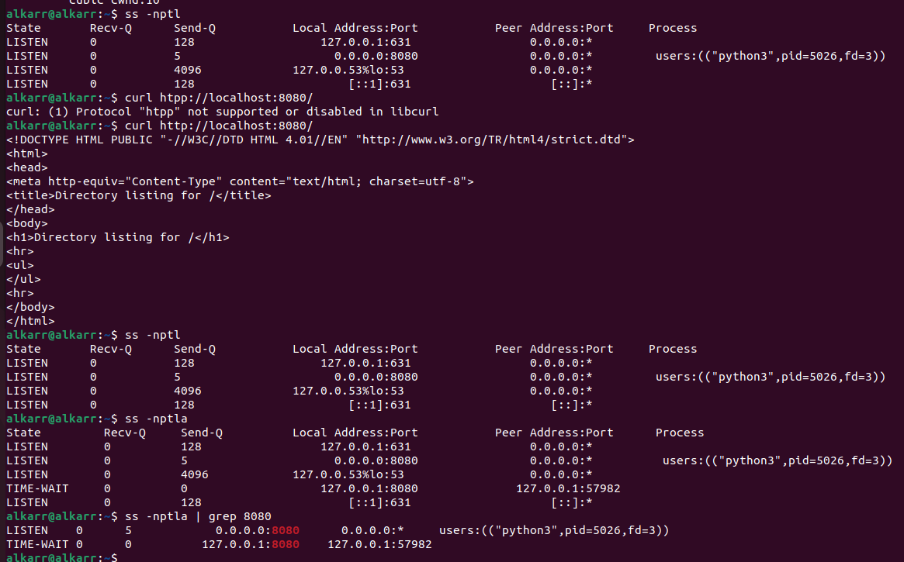

**TIME-WAIT** - состояние TCP-соединения, при котором оно было закрыто, но при этом еще не удалено.

Удалить нельзя по простой причине - так сказано в RFC :peka:. (Главная причина - надежность)
Но на самом деле из-за того, что пакеты могут приходить в неуопрядоченном состоянии - могут быть продублированы,
а так же дать время на то, что бы другая сторона приняла FIN (ACK потерялся) о закрытии соединения.
Сокет закроется через N-времени (2*MSL (60с) = 120с)

- Опишите, к каким проблемам может привести большое количество TIME-WAIT сокетов.

Возможная проблема производительности (задержка установки нового соединения, работы с сокетами, лишняя нагрузка на ядро),
так же может вылиться ошибка использования соединения по тому же порту - тк есть еще живой сокет (а так же просто кончится доступное кол-во сокетов)

---

### Задание 2. Динамическая маршрутизация с BIRD (35 баллов)
- Создайте dummy-интерфейс с адресом 192.168.14.88/32, назовите его service_0.

Создаю заглушку и привязываю к ней адрес:

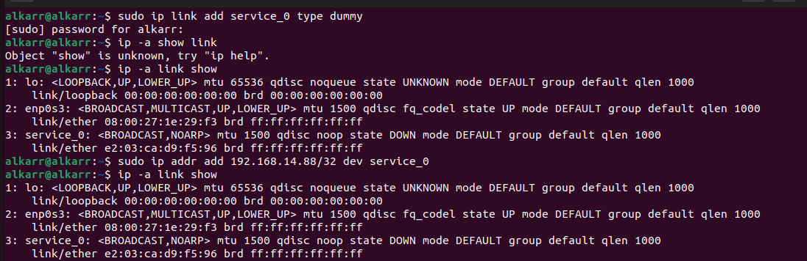

Проверяю, что все сработало:

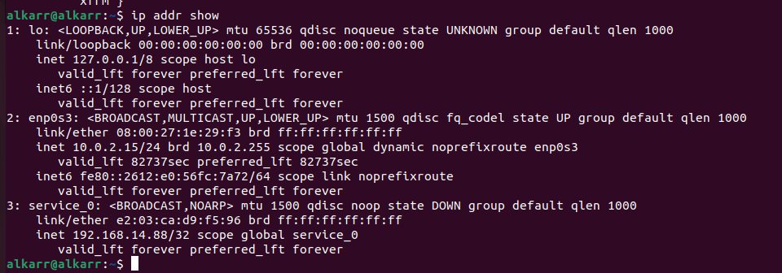

- При помощи BIRD проаннонсируйте этот адрес при помощи протокола RIP v2 включенного на вашем интерфейсе (eth0/ens33), а так же любой другой будущий адрес из подсети 192.168.14.0/24 но только если у него будет маска подсети /32 и имя будет начинаться на service_

Создаем bird.conf:

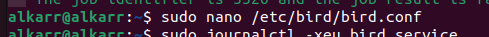

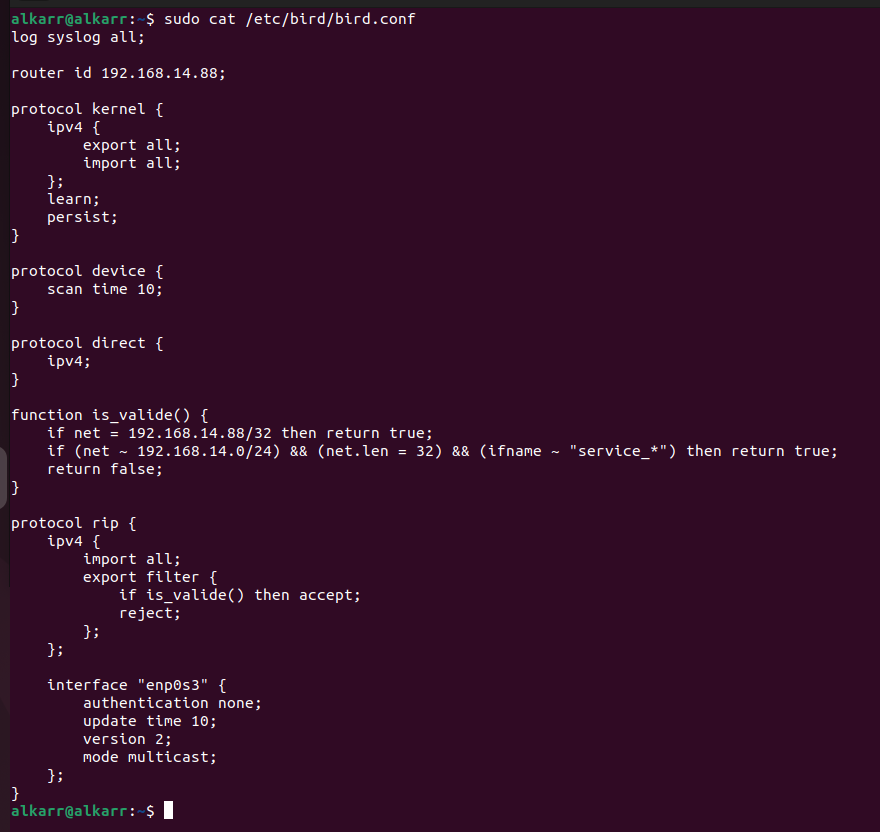

Запускаю BIRD

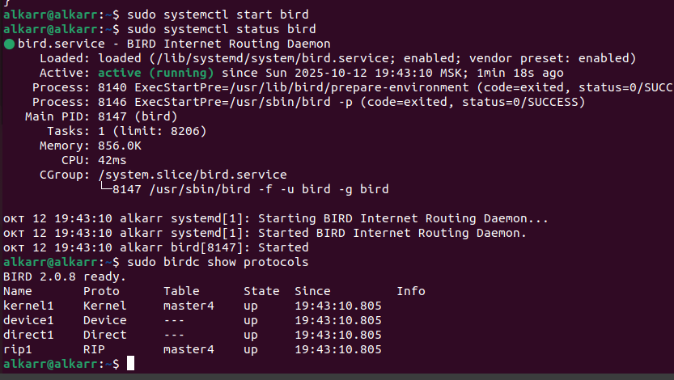

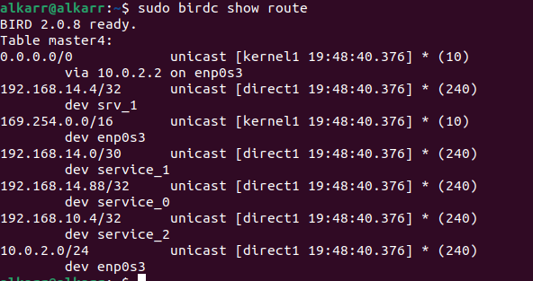

- Создайте ещё три интерфейса:

```
service_1 192.168.14.1/30
service_2 192.168.10.4/32
srv_1 192.168.14.4/32
```

Создаю эти интерфейсы:

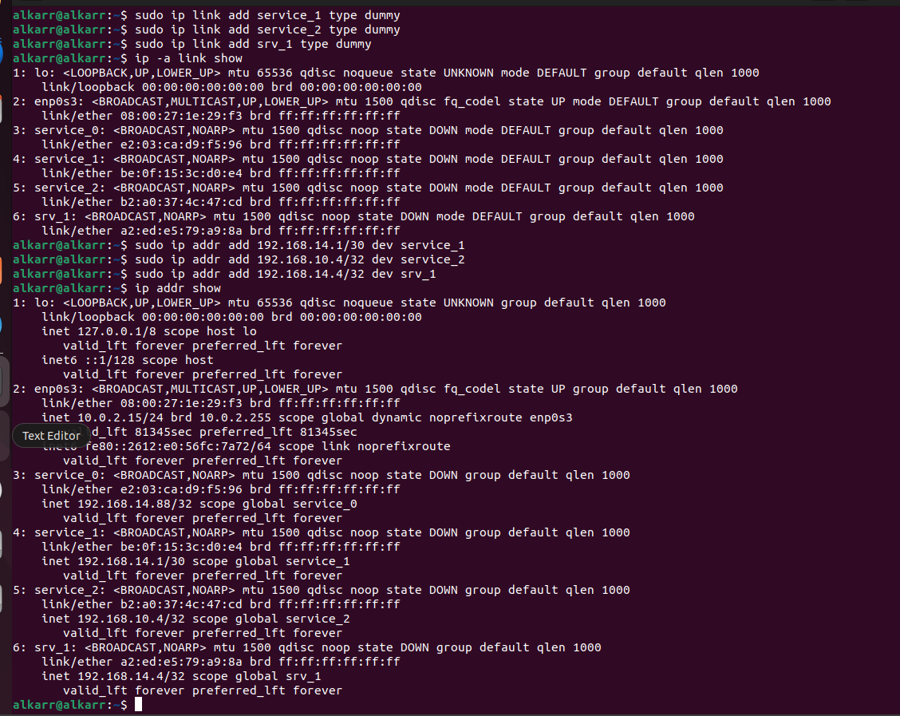

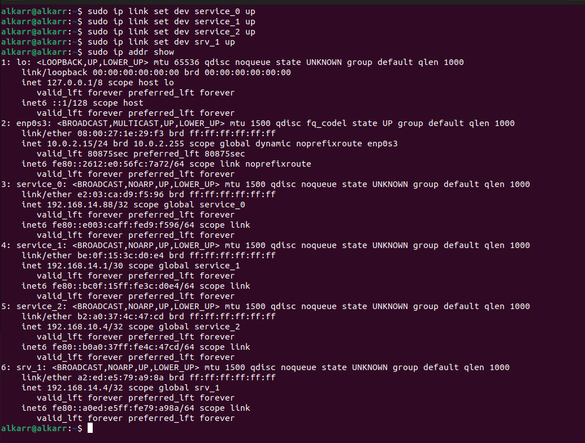

- С помощью tcpdump докажите, что анонсируются только нужные адреса, без лишних.

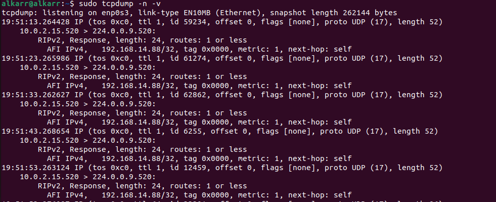

Вызываю `sudo tcpdump -n -v` и вижу, что вызовы RIPv2 есть только для 192.168.14.88/32, 
тк srv_1 - не проходит по маске service, 

---

### Задание 3. Настройка фаервола/ Host Firewalling (25 баллов)
- С помощью iptables или nftables создайте правило, запрещающее подключения к порту 8080.

Создаю и проверяю, что правило появилось:

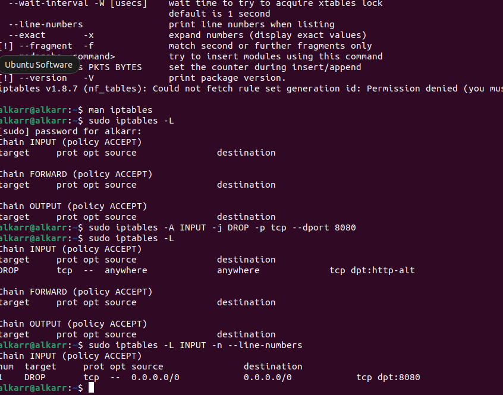

- Запустите веб сервер на питоне и продемонстрируйте работу вашего firewall при помощи tcpdump.

Запускаю сервер:

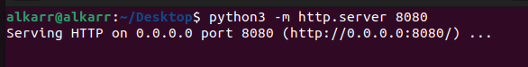

И вызываю `curl http://localhost:8080` и `tcpdump`:


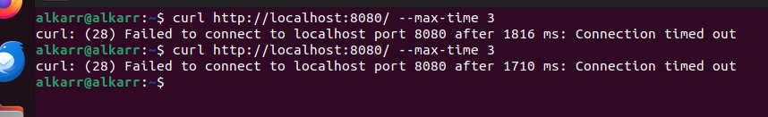

Как видно по результатам - ответа нет, только попытки отправки, при этом из 1ого задания видно, что изначально ответ был

---

### Задание 4. Аппаратное ускорение сетевого трафика (offloading) (15 баллов)
- С помощью ethtool исследуйте offload возможности вашего сетевого адаптера.

Просмотор настроек через `ethtool -k <adapter (ip -a link)>` 

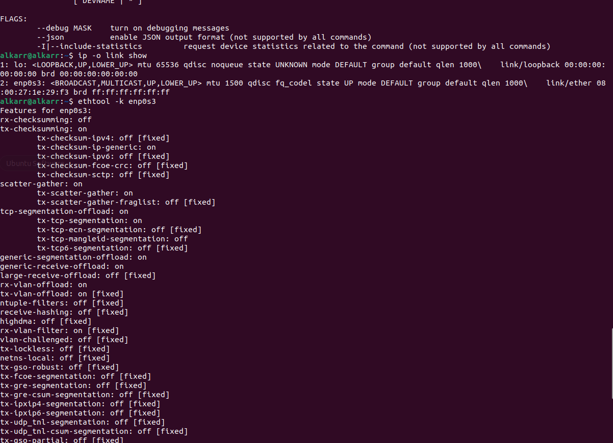

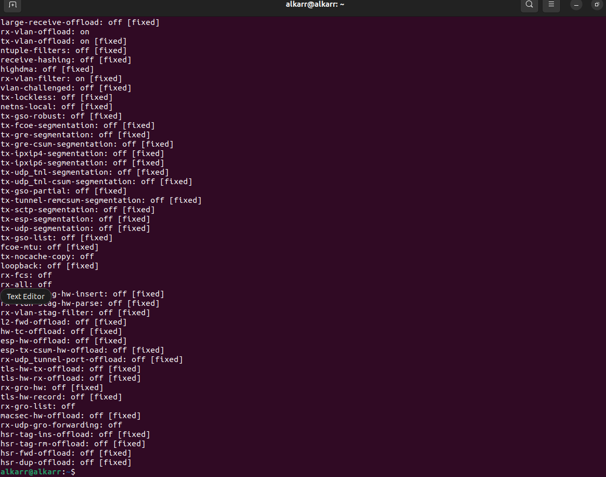

Поиск с grep по слову `offload`

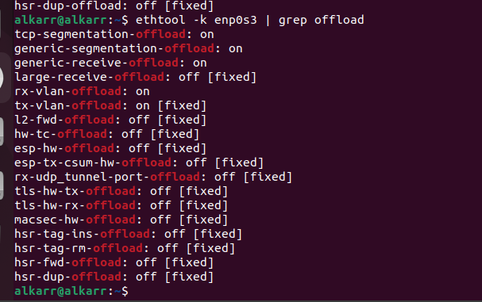


- Покажите включён ли TCP segmentation offload.

Из общего списка видно, что он включен

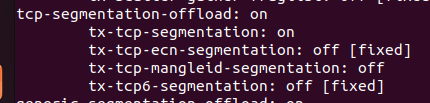

- Объясните, какую задачу решает TCP segmentation offload.

Если **TSO** включено, то заместо сегментации данных со стороны ядра - этим занимается сетевой адаптер. 
Если пакет получается большим размером (больше MTU например), то он отправляется целиком в адаптер, а он уже его делит, что позволяет снизить нагрузку на CPU машины.
