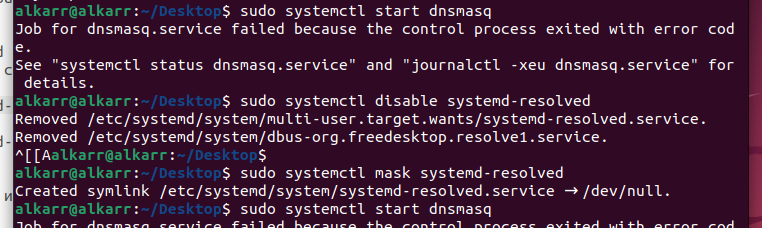

## LAB5 - WEB. High Performance WEB и CDN

### Задание 1. Создание Server Pool для backend
- Создайте у себя в home dir 2 папки ~/backend1 и ~/backend2, в каждой из которых должен лежать 1 index.html

"`<h1>Response from Backend Server 1</h1>`" для backend1

"`<h2>*** Response from Backend Server 2 ***</h2>`"  для backend2

- внутри этих папок запустите питоновый http сервер на портах 8081 и 8082 соответсвенно.

Создаю 2 папки с файлами index.html, запускаю сервера и проверяю их запуск через `curl localhost:808(1|2)`

### Задание 2. DNS Load Balancing с помощью dnsmasq
- При помощи dnsmasq создайте 2 A записи

  * my-awesome-highload-app.local,127.0.0.1
  * my-awesome-highload-app.local,127.0.0.2

Редактирую конфиг через `sudo nano /etc/dnsmasq.conf`:
Вношу изменения: 
  * port = 53 (раскомментирую строчку)
  * no-resolv (раскомментирую строчку)
  * log-queries (раскомментирую строчку)
  * log-dhcp (раскомментирую строчку)
  * listen-address=127.0.0.1
  * address=/my-awesome-highload-app.local/127.0.0.1 (Добавляю)
  * address=/my-awesome-highload-app.local/127.0.0.2 (Добавляю)

- Запустите dnsmasq и при помощи dig обратитесь к 127.0.0.1 для резолва my-awesome-highload-app.local

Отключаю systemd-resolved
  

И запускаю dnsmasq

Проверяю резолвинг через `dig`

Как видно из ответа - есть 2 A записи

Так же WARNING - поэтому я добавил строчку local=/local/

- Проанализируйте вывод, что произойдет с DNS записями если backend2 сервер сломается?

В случае, если backend2 будет не доступен:

Тк пользователь получает 2 возможных IP-адреса, то он может подключиться сначала к backend2 - получить ошибку недоступности -> обратится к 1ому. (в зависимости от настроек - если включен Round-Robin - rr)
В таком случае получим ненужный простой. DNS-сервер не знает о недоступности самого сервера, он автоматом не исключает запись, как бы это мог делать балансер.

### Задание 3. Балансировка Layer 4 с помощью IPVS
- Создайте dummy1 интерфейс с адресом 192.168.100.1/32

Созданный интерфейс:

- Используя ipvsadm создайте VS для TCP порта 80 ведущего в 127.0.0.1:8081 и 127.0.0.1:8082 использующего round-robin тип балансировки.

С проверкой создания (балансировка - rr)

- Используя curl сходите в http://192.168.100.1 продемонстрируйте счетчики на ipvs, убедитесь, что балансировка происходит.

Как видно по результатам - балансировка работает:

вес каждого сервера - 1, тип - rr, поэтому ходится по очереди в каждый из серверов, InActConn увеличился соразмерно обращениям к каждому из серверов

### Задание 4. Балансировка L7 с помощью NGINX    
- Создайте пул из 127.0.0.1:8081 и 127.0.0.1:8082 в nginx с active-backup балансировкой.
- Nginx должен слушать только 127.0.0.1 tcp порт 8888 и проставлять заголовок X-high-load-test 123 проксируя в аптсрим.

Обновляю конфиг nginx: - `/etc/nginx/nginx.conf`

По заданным условиям: попытки - 7шт для первого сервера, а второй - backup, с добавлением заголовка

по [дефолту](https://nginx.org/en/docs/http/ngx_http_upstream_module.html#max_fails) там 1:

Проверяю, что конфиг правильный и перезапускаю nginx:

Отправляю тестовый запрос:

- Покажите при помощи tshark http запрос и ответ

Подключаюсь через tshark для 1ого запроса и получаю [результат](shark.txt)

Заголовок есть:

- Убедитесь, что переключение на backup сервер происходит после 7 неудачных попыток сходить в активный сервер.

Я немного схитрил и поднял сервер на питоне с портом 8081, который все время отдает ответ 500:

И теперь отправив 8 и более запросов это можно увидеть напрямую:

После 7 запросов - nginx больше не шел на 8081, только на 8082

